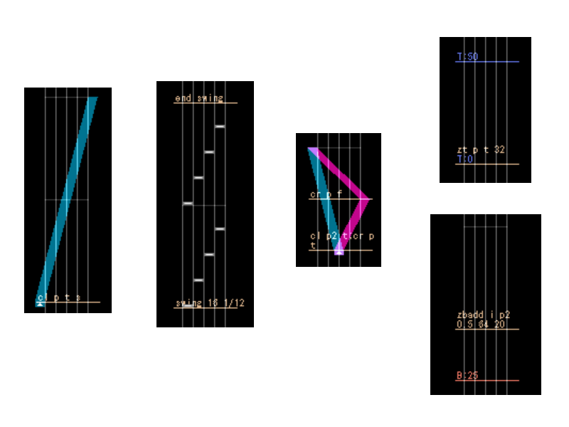
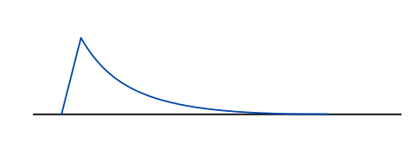
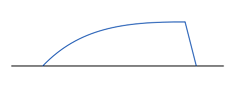
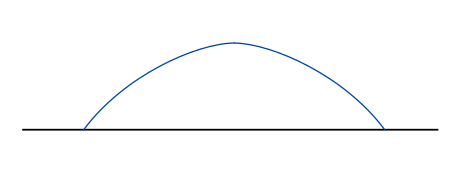

# KSHRAM command guide #

## GENERAL

### How to Write Commands in Your Chart(KSH format)

Commands for KSHRAM are comments in ksm charts. You can add a line of comment by ctrl+shift+left clicking on the chart when in Pen tool + Position mode. The starting "//" part should be kept for commands to function normally, but you don't need to add it inside ksm editor as it automatically puts one when saving your chart. (adding extra `//`s can turn commands into REAL comments, however.)

A command has the following syntax:

```
COMMAND_NAME ARGS ARGS ARGS...
```

Currently there are two types of commands. One requires an "end" mark to indicate the range. The other, which does not require such "end" type command, is typically placed at the beginning of some objects, like a line of knob, to perform its functionality.

Any type of command requiring an "end" mark cannot have its range overlapping with another command of the same type. If the same type of command is used again at the end time of the last one, "start" mark should be written after the "end" mark.

Command names and most args used to determine types are case-insensitive.

```
RANGED_COMMAND
...
end RANGED_COMMAND;RANGED_COMMAND
...
end RANGED_COMMAND
```

Multiple commands can be placed in one comment line, by separating each of them with ";". Commands are executed in the following order:
​    - From the start of the chart to the end;
​    - From the first command to the last when in the same line of comment.

```
cl p2 t g;cr p2 f g
```

You can explicitly delay a command's execution time by adding the prefix `#N`. N represents the delay number(which is a positive integer). A delayed command will not execute until every other command that has a lower delay number has been executed.

> Commands that require "end" marks should have the same delay number as their "end" marks.
> 
> When multiple commands have the same delay number, the execution order follows the rules mentioned above.

```
cl p2 t g;#1 tiltstyle mid 2x
```

If a command begins with `#` but does not follow a positive integer, it will not be recognized as a delayed command.

You can put extra `//`s in front of a comment to ensure it is a REAL comment and will not be processed by KSHRAM. In fact, anything that does not start with a command keyword will not be treated as commands and will remain in the output chart.

```
(in editor)
// your comment
(in ksh file)
//// your comment
```

### Image Showcase




### Parameter definition syntax in this document

`xxx` Fixed literal string "xxx".

(xxx) Optional, literal string "xxx"

`[xxx]` A required parameter named "xxx"

`([xxx])` An optional parameter named "xxx"

> Optional parameters usually appears only at the end of a command. You need to provide all optional parameters before the last one you want to write out, like calling C++ functions with default parameter values.

`[xxx...]` A list of parameters with the same type that will be further explained in the document. Although providing none will not always cause a problem, it is suggested that at least one parameter should be provided.

### Parameter Types

`INT` Integer(in most cases, positive integer).<br>
Example：1, 3, 16

`REAL` Real Number. Decimals and scientific notations are supported.<br>
Example：1.0, 0.67, 1.0e-2

`RATIO` Real Number, but supports fractions(syntax: `a/b').<br>
Example：0.67, 2/3

`BOOL` Boolean value. should be one of the following: `t`, `true`, `f`, `false`.

`ENUM` enumeration strings. Valid values will be listed out.

`ANY` A string of any type. You won't often see this type in this document.

### Common Parameters

<div id = "common_length"></div>

`[length]`

A time length parameter in units of beats. Supports decimal or fractions.

Possible values：1 , 1.0 , 1/3

<div id = "common_div"></div>

`[div]`

Beat snap divisor. Mostly used to determine the interval between two marks that will be generated by this command.


Examples:
​    div = 16 means one mark every 1/4 beat;
​    div = 24 means one mark every 1/6 beat.

<div id = "common_amp"></div>

`[amp]`

Amplifier. The actual meaning of it varys. Supports decimal or fractions.

<div id = "common_reverse"></div>

`[reverse]`

A boolean value. When reverse is True, certain property of the command will change.This is not equivalent to reversing the output in the time dimension.

Possible value：t / true; f / false.

## Commands

### Add a certain mark

```
mark [type] [value] ([value2])
      ENUM   ANY      ANY
```

This command writes a mark where it's executed. If 2 values are given, the mark written will form a sudden change. Note that this command won't check if the given value is valid or the mark type supports sudden change of its value. The exact string of [value] and [value2] will be assigned.

`[type]`

Mark type enum.

| VALUE  | EXPLANATION           | VALUE     | EXPLANATION           |
| ------------------- | -------------- | ------------------- | -------------- |
| bpm                 | BPM            | sig / signature     | time signature     |
| fxlong_l / fxlong_r | fx long effector | fxchip_l / fxchip_r | fx chip se   |
| filter              | knob effector   | slamsound           | knob slam se |
| knobvol             | knob effector vol | slamvol             | knob slam vol   |
| zt / zoomtop        | zoom top     | zb / zoombottom     | zoom bottom     |
| zs / zoomside       | zoom side   | tilt                | lane tilt       |
| split               | lane split | stop                | chart stop effect   |
| laser2x_l / laser2x_r  | knob expanding to 2x   |

`[value]` & `[value2]`

Value(s) to be written. The exact string of [value] and [value2] will be assigned.

if you want to include semicolons(`;`) in [value] or [value2], enclose [value] (or [value2]) in a pair of braces(`{ }`). For example:

```
mark fxlong_l {gate;16}
```

There is no need to include braces in [value] so no escape character is given for now.

> /!\ When adding lane tilt marks using this command, remember that ksh records actual tilt mark value as 1/100 of the value shown in ksm editor. You should write the actual mark value in [value] (and [value2]).

### Add a certain note

```
note [type] [start_time] ([end_time])
      ENUM      RATIO        RATIO
```

Add a note, chip or long, at the relative `start_time` of the command's execution time. long note will end at the relative `end_time`.

This command determines whether to add a chip or a long note by checking if the param `end_time` is given or not.

Adding a new long note will overwrite any existing chip notes that overlaps with it, and any long notes whose start position is inside the new note.

`[type]`

| VALUE | EXPLANATION |
| -------- | --- |
| a       | BT-A |
| b       | BT-B |
| c       | BT-C |
| d       | BT-D |
| l       | BT-L |
| r       | BT-R |

`[start_time]` 和 `[end_time]`

Time to add the note. They are counted relative to the command's execution time, in units of beats. 

You can set these 2 params to be ticks that can't be precisely recorded in ksh format, for example `1/5`. In this case, KSHRAM will take the nearest approximation.


### Add knob lines and slams

#### `knob` command

```
knob [side] [start_time] [end_time] [start_pos] [end_pos]
      ENUM     RATIO       RATIO        INT        INT
```

Add a knob line between `start_time` and `end_time` relative to the command's execution time.
The knob line should not overlap with existing knob lines. Any confliction with existing knobs will cause this command to report an error and fail.

> ksh format limits that an interval of at least 1/24 beat is required between any two knob objects, otherwise they will be connected together.

`[side]`

| VALUE | EXPLANATION |
| -------- | --- |
| l       | left side knob |
| r       | right side knob |

`[start_time]` & `[end_time]`

Time counted relative to the command's execution time, in units of beats. 

You can set these 2 params to be ticks that can't be precisely recorded in ksh format, for example `1/5`. In this case, KSHRAM will take the nearest approximation.

`[start_pos]` & `[end_pos]`

Starting position and ending position. Should be between 0~50.

If you want to expand the knob to 2x mode, use `mark` command at it's start time.

#### `knobadd` command

```
knobadd [side] [end_time] [end_pos]
         ENUM     RATIO      INT
```

Add a knob line from the last end position before `end_time` to `end_time` relative to the command's execution time. It is guaranteed to be connected to previous knob end position if successful.

The knob that is going to be added should last longer than 1/8 beat(or it will become a slam in ksh format) or have no position change. If not, the command will report an error and fail.

`[side]`

| VALUE | EXPLANATION |
| -------- | --- |
| l       | left side knob |
| r       | right side knob |

`[end_time]`

Time counted relative to the command's execution time, in units of beats. 

You can set it to be ticks that can't be precisely recorded in ksh format, for example `1/5`. In this case, KSHRAM will take the nearest approximation.

`[end_pos]`

Ending position. Should be between 0~50.

#### `slam` command

```
slam [side] [time] [start_pos] [end_pos] ([duration])
      ENUM  RATIO    INT          INT        RATIO
```

Add a knob slam at `time` relative to the command's execution time.
The slam should not conflict with any existing knobs, or the command will report an error and fail.

`[side]`

| VALUE | EXPLANATION |
| -------- | --- |
| l       | left side knob |
| r       | right side knob |

`[time]`

Time counted relative to the command's execution time, in units of beats. 

You can set it to be ticks that can't be precisely recorded in ksh format, for example `1/5`. In this case, KSHRAM will take the nearest approximation.

`[start_pos]` & `[end_pos]`

Starting position and ending position. Should be between 0~50.

Since we are adding a slam, `start_pos` should not be equal to `end_pos`.

`[duration]`

How long the knob slam should be. The default value is 1/8 beat, and without special need you should just stick to the default value.

Knob slams shorter than 1/8 may look really strange.

Try this example below:

```
batch define knob_example
{
    // Left side
    knob L 0 2 0 50;
    slam L 2 50 0;
    knobadd L 4 50;
    slam L 4 50 0;
    // Right side
    knob R 0 2/3 0 50;
    knobadd R 4/3 0;
    knobadd R 2 50;
    slam R 2 50 0;
    knobadd R 8/3 50;
    knobadd R 10/3 0;
    knobadd R 4 50;
    slam R 4 50 0;
}
```


#### Combination of the commands

By using the commands together in a batch, one can generate complicated patterns.
Draw the first section with `knob` or `slam`, and connect the rest with `knobadd`. 


### Curve Knob Generation

```
cl / cr [type] [reverse] ([mode]) ([amp])
         ENUM   BOOL       ENUM    REAL
```

This command is placed at the beginning of a straight knob to translate it into a curved one. 

A "straight knob" is a knob that has no key points in the middle. When you select a visually straight knob, if the whole knob line turns bright, then it is (likely) a "straight knob".

"cl" is for left(blue) knob, and "cr" is for right(red) knob.


`[type]`

| VALUE              | EXPLANATION |
| --------              | ------------ |
| p / parabola          | parabola #1 |
| p2 / parabola2        | parabola #2 (slightly different) |
| c / cubic             | cubic #1 |
| c2 / cubic2           | cubic #2 (slightly different) |
| sl / smoothlinear     | straight line with a rounded start #1 |
| sl2 / smoothlinear2   | straight line with a rounded start #2 (longer rounded range) |
| s / sine              | sinusoidal wave (1/4 of a cycle) |
| e / exp               | exponential function: `e^ax - ax`. `a` is determined by `amp`. |
| xn                    | power function: `x^n`. `n` is determined by `amp`. |

`[reverse]`

See：[Common parameters](#common_reverse).
If reverse = true, the curve will have a decreaseing slope, like the "J" shape.
Otherwise it will have a increasing slope, like the "r" shape.

`[mode]`

| VALUE | EXPLANATION |
| -------- | ------------ |
| s / static  | Step is fixed at multiples of 1/6 beat. |
| d / dynamic | Step is not fixed. |
| g / global  | Itoda Raleph's algorithm |

if not provided, the generator will automatically pick one judging from the knob's length.

> Dynamic / Global mode could dramatically increase the record size of a measure. 
> Use static mode for short curves.

`[amp]` 

Used by some of the curve types. It has no effect on other types.

| Curve Type | Default Value | Range | Note |
| ------- | -------- | ------ | --- |
| e / exp | 1.0 | 0.0001 ~ 5.0 | bigger value gives a less steep curve |
| xn      | 2.0 | 1.0 ~ 5.0 | bigger value gives a steeper curve |


### Smooth Camera Effects

```
zt / zb / zs / tilt / split [type] [reverse] [div] ([amp])
                             ENUM   BOOL      INT   REAL
```

This command is placed at the same time of a corresponding camera key point mark. Then, the next camera key point mark will be the end position. The transition in between will be interpolated into curves.

"zt" is for zoom_top;<br>
"zb" is for zoom_bottom;<br>
"zs" is for zoom_side;<br>
"tilt" is for lane tilting;<br>
"split" is for center splitting.

> NOTE: for tilt mode, both of the marks should be numbers, not auto tilting mode such as "NORMAL" or "ZERO".


`[type]`

| VALUE              | EXPLANATION |
| --------              | ------------ |
| p / parabola          | parabola #1 |
| p2 / parabola2        | parabola #2 (slightly different) |
| c / cubic             | cubic #1 |
| c2 / cubic2           | cubic #2 (slightly different) |
| sl / smoothlinear     | straight line with a rounded start #1 |
| sl2 / smoothlinear2   | straight line with a rounded start #2 (longer rounded range) |
| s / sine              | sinusoidal wave (1/4 of a cycle) |
| e / exp               | exponential function: `e^ax - ax`. `a` is determined by `amp`. |
| xn                    | power function: `x^n`. `n` is determined by `amp`. |

`[reverse]`

See：[Common parameters](#common_reverse).
If reverse = true, the curve will have a decreaseing slope, like the "J" shape.
Otherwise it will have a increasing slope, like the "r" shape.

`[div]`

See：[Common parameters](#common_div).

`[amp]` 

Used by some of the curve types. It has no effect on other types.

| Curve Type | Default Value | Range | Note |
| ------- | -------- | ------ | --- |
| e / exp | 1.0 | 0.0001 ~ 5.0 | bigger value gives a less steep curve |
| xn      | 2.0 | 1.0 ~ 5.0 | bigger value gives a steeper curve |


### Smooth Camera Effects (Incremental)

```
ztadd / zbadd / zsadd / splitadd [mode] [curve_type] [length] [div] [offset] ([amp])
                                  ENUm   ENUM         RATIO    INT   REAL     REAL
```

This command is placed at the start time where you want a incremental effect to take place.
It Adds some camera changes onto the existing camera effect.

`[mode]`

| VALUE  | EXPLANATION |
| --------- | --- |
| i / impact | impact effect: suddenly increase offset value, then gradually return |
| ri / rimpact | the reverse of impact effect |
| c / charge | charge-trigger effect: gradually charge up to offset value, then suddenly return to 0 |
| rc / rcharge | the reverse of charge-trigger effect |
| a / arch | increase to offset and come back like a "C" shape |

Here are some images showing how each mode look like:



<center>impact curve</center>



<center>charge curve</center>



<center>arch curve</center>

`[curve_type]`

| VALUE              | EXPLANATION |
| --------              | ------------ |
| p / parabola          | parabola #1 |
| p2 / parabola2        | parabola #2 (slightly different) |
| c / cubic             | cubic #1 |
| c2 / cubic2           | cubic #2 (slightly different) |
| sl / smoothlinear     | straight line with a rounded start #1 |
| sl2 / smoothlinear2   | straight line with a rounded start #2 (longer rounded range) |
| s / sine              | sinusoidal wave (1/4 of a cycle) |
| e / exp               | exponential function: `e^ax - ax`. `a` is determined by `amp`. |
| xn                    | power function: `x^n`. `n` is determined by `amp`. |

`[length]` 

See：[Common parameters](#common_length).

`[div]`

See：[Common parameters](#common_div).

`[offset]`

The maximum offset of the curve. 

`[amp]`

Used by some of the curve types. It has no effect on other types.

| Curve Type | Default Value | Range | Note |
| ------- | -------- | ------ | --- |
| e / exp | 1.0 | 0.0001 ~ 5.0 | bigger value gives a less steep curve |
| xn      | 2.0 | 1.0 ~ 5.0 | bigger value gives a steeper curve |


### Speed Variation Effects

```
svfx [type] [reverse] [length] [div] ([amp]) ([BPM])
      ENUM   BOOL      RATIO    INT   REAL    REAL
```

`[type]`

Curves here are in bpm-time dimensions.

| VALUE      | EXPLANATION |
| ------------- | --- |
| l  / linear   | linear curve |
| p  / parabola | parabola |
| sq / sqrt     | square root |
| s  / sine     | 1/4 cycle of the sine wave |
| e  / exp      | exponential curve |

`[reverse]`

See：[Common parameters](#common_reverse).

If reverse = true, BPM will decrease in time; Otherwise it will increase.

`[length]` 

See：[Common parameters](#common_length).

`[div]`

See：[Common parameters](#common_div).

`[amp]`

Adjustable parameter for all SVFX curve types. Possible range is (in theory) 0 ~ +∞, 
but with calculation limits of `float64` it's not recommended to be too small or too large, or overflows would occur.

For all curve types the bigger `amp` is, the less intense BPM will be changed, with an exception of type `e / exp`, which is reversed.

The default value will always be 1.0.

`[BPM]` 

Equivalent constant BPM value for reference. If not given explicitly, the BPM value at the command will be used.

### Camera Amplifier

> In case a range of camera is too mild or shaky.

Starting Command：

```
ztamp / zbamp / zsamp / tiltamp / splitamp [amp] ([ref_center])
                                          REAL        REAL
```

Ending Command：

```
end ztamp / zbamp / zsamp / tiltamp / splitamp
```

Amplify all corresponding camera marks in its range. Starting point is included but end is not.<br>
Auto tilting mode such as `NORMAL` will not be affected by the command by `tiltamp`.

`[amp]`

Multiplier. 

`[ref_center]`

Center value. The default value is 0.

Amplification will follow the following equation:

```
camera_after = amp * (camera_before - ref_center) + ref_center
```

### Swinging

Starting command:

```
swing [div] [delay]
       INT   RATIO
```

Ending Command：

```
end swing
```

Translate all rhythms in range to a swinging one, which delays `(2n-1/[div])`th notes for `[delay]`` beats.<br>
All types of notes, marks, and comments(at the tick to swing) will be affected, except for the comments where the swing(both start and end) commands are written in. It is suggested to place the starting/ending command at non-swinging time(for example, at full beats).

`[div]` 

See：[Common parameters](#common_div).

`[delay]` 

How much the swing should delay every `(2n-1/[div])`th notes. In units of beats.<br>
`delay` must be smaller than `4/div` beats.
​    
Example：<br>
[div] = 16, [delay] = 1/12: moves every 1/4th beat to 1/3rd beat, and every 3/4th beat to 5/6th beat.


### Auto Tilting from Knobs

```
// starting command
// 1 smoothing mode can be selected in [style]
tiltstyle [style...] ([amp])
           ENUM       REAL

// mid command
// smoothing mode cannot be selected in [style]
tiltstyle [style...] ([amp])
           ENUM       REAL

// end command
end tiltstyle
```

Automatically generate tilt marks in the command's range, based on knobs' position.

The command will only place marks in its range. If you want smooth transition at both ends, place this command 2 beats wider on each side of the knob objects.

`[style...]`

Style selections which determines how to tilt according to knob positions.

You can only select one style for each of the tables below. You can write multiple styles in one command, separated with blanks.

| STYLE          | EFFECT |
| ---------------- | ------ |
| side | tilt = 0 when knob is at default position(0 for L, 50 for R). Default. |
| mid | tilt = 0 when knob is at the center(25). |
| keep | tilt rule is the same as `side`, but the angle won't decrease as long as knob exists. |

| STYLE          | EFFECT |
| ---------------- | ------ |
| 2x | Tilt according to the knob's visual position. Knobs with laser2x yield tilt angles in an extended range. |
|    | Default is off. |

| STYLE          | EFFECT |
| ---------------- | ------ |
| left | Only the left side knob affects tilt angle. |
| right | Only the right side knob affects tilt angle. |
|      | Default is to consider both sides. |

The chart below is the smoothing style. This can only be selected once in the starting command.

| STYLE          | EFFECT |
| ---------------- | ------ |
| ksm | Smoothing that resembles K-Shoot Mania original style. Default. |
| uniform | Always complete transition within 1/2 beat. |
| sudden | No smoothing at all. Tilt value will change instantly. |

`[amp]`

Amplifier of the tilt angle. Default is 1.0.

When at default, a max tilt is `tilt=1.0` (100 when viewed in editor).

You can assign a negative value to `amp` if you want to reverse the tilt direction.


### Delay

```
delay [step] [subcmds...]
      RATIO   COMMAND
```

Instantly execute a command at later time position on the chart.

`[step]`

Where the command should be executed, relative to the command's position, in units of beats.

This value should be positive.

`[subcmds]`

The command(s) to be executed. In the case of multiple commands, enclose them with braces.

Examples:

```
delay 0.5 ztadd i p 0.5 64 100
 -> will execute "ztadd i p 0.5 64 100" 0.5 beats afterward.

delay 2 {cl p t;cr p t}
 -> will execute "cl p t" & "cr p t" 2 beats afterward.

```

### Simple Loop

```
loop [count] [step] [subcmds...]
      INT    RATIO   COMMAND
```

Execute the same command several times, moving forward a constant time interval between each step.

`[count]`

Loop count. Should be at least 2.

`[step]`

Time interval between each step, in units of beats. Has to be positive.
The first execution time will always be `0`, and the rest at `step`, `2*step`, etc.

`[subcmds]`

The command(s) to be executed. In the case of multiple commands, enclose them with braces.

Examples:

```
loop 8 0.5 ztadd i p 0.5 64 100
 -> execute "ztadd i p 0.5 64 100" 8 times, with 0.5 beat interval

loop 4 2 {cl p t;cr p t}
 -> execute "cl p t" & "cr p t" 4 times, with 2 beats interval

```

### Command Batch


```
// define a batch
batch define [name] [batch commands...]
             STRING      COMMAND

// call a batch
batch call [name]
           STRING

// load batches from a text file
batch import [file path]
               STRING
```

Define batches, and use them anywhere after definition.
All batches are globally callable for now.
Batches can be defined in an external text file and loaded.

`[name]`

Name of the batch, should be unique. Blank characters, braces, semicolons are invalid chars for names.
It is suggested to name every batch following the rules of symbol naming in most programming language (not lisp), as more special characters may turn invalid in the future.


`[batch commands]`

The content of a batch. In the case of multiple commands, enclose them with braces.

If a batch is defined in a file,

`[file path]`

Path of the file that contains command definition.
Path can be absolute, or relative to the following root:

- KSHRAM program dir
- Current working dir (for console mode)
- Input chart dir

In the case of multiple file matches, the program will search in the order showed above and open the first found file.

#### Defining batches in an external text file

Follow the examples below:

```
batch define bump4
{
    loop 4 2
    {
        // write comments here
        ztadd sq 1 32 25;
        zbadd sq 1 32 25;
    // the semicolon next line is for the end of loop command.
    };
}

batch define fifsnake
{
    // generate knob
    knob L 0 4/5 0 50;
    knobadd L 8/5 0;
    knobadd L 12/5 50;
    knobadd L 16/5 0;
    knobadd L 4 50;
    slam L 4 50 0;
    // make curves
    cl p t g;
    delay 4/5 cl p f g;
    delay 8/5 cl p t g;
    delay 12/5 cl p f g;
    delay 16/5 cl p t g;
}


```

You can define multiple batches in one file. Make sure every `batch define` takes a new line.

Only `//` comments in an empty line is accepted. There is no in-the-line comment or block comment for now.