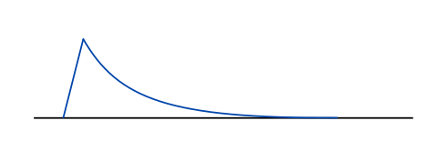
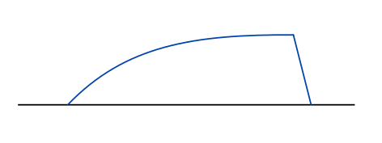

# KSHRAM 命令格式说明

### <命令的使用方式>

KSHRAM能够处理写在ksh格式谱面当中的命令，对谱面内容进行指定的处理。

KSHRAM的命令以注释的方式放在谱面当中。在ksm editor当中，处于编辑+位置（快捷键O）状态时，
ctrl+shift+左键单击谱面，即可在点击位置插入注释。

单条命令的格式是：

```
(前缀) 命令 参数 参数 ...
```

> 现在前缀部分只有延迟标记，后面会介绍。

通常而言，作用于谱面中某种对象的命令，其位置写在对象的开头；
不作用于已有对象而是创造新的对象的命令，其位置写在所需创造的起始位置；
作用于一个时间段的命令，其起始命令写在起始位置，通过在终止位置写终止命令或通过起始命令传递时长参数决定作用范围。

同一时刻可以存在多条命令。命令间用';'隔开。如：

```
cl p2 t g;cr p2 f g
```

在命令前面添加`#[数字]`前缀，可以使命令延迟执行。数字表示命令的延迟值，须是正整数。

```
cl p2 t g;#1 tiltstyle mid 2x
...
#1 end tiltstyle
```

延迟值越大，命令执行越靠后。延迟值相同的命令会按照谱面上的先后顺序、同一注释中命令出现的先后顺序来执行。
没有前缀的命令的延迟值是0.
> 如果是包含终止命令的命令组，那么起始和终止命令须具有相同的延迟值。

`#`后面跟的内容不是整数（包括直接跟空格）的话不会被视作一个有效的命令。你可以用它来写注释，不过推荐使用`//`开头的内容来表示注释。（在谱面文件中就会是`////`的开头）


### <使用命令的图例>


### <命令中的参数格式标识说明>

`xxx` 表示固定的字符串xxx。

(xxx) 表示可选择写出固定字符串xxx或者不写。

`[xxx]` 表示一个必填项。xxx是它在接下来的说明当中使用的名称。

`([xxx])` 表示是一个可选项。如果可选项不给出，那么它会采用默认值（在说明中会给出默认值是什么）。

> 可选项一般只会出现在末尾（类似于函数的默认值参数那样）。如果需要给某个可选参数赋值，这个参数及其之前的所有可选参数都要写出。

`[xxx...]` 表示是一个列表项。可以在这一项上写相同类型的若干个参数。列表参数之间也用空格分隔，并且不需要用任何括号将列表框起来（至少目前如此）。


### <参数类型说明>

`INT` 整数（通常是正整数）。<br>
例如：1, 3, 16

`REAL` 实数。可使用小数以及科学计数法。<br>
例如：1.0, 0.67, 1.0e-2

`RATIO` 既可以写小数也可以写分数(`a/b`的格式，a和b都是`REAL`类型)的实数。<br>
例如：0.67, 2/3

`BOOL` 布尔值。只能写 `t` / `true` 或者 `f` / `false`.

`ENUM` 特定的字符串。可以写的字符串将在说明中给出。

`ANY` 任意的字符串。

### <常见参数说明>

<div id = "common_length"></div>

`[length]`

命令作用的长度，单位是拍。可以写小数或是分数。写分数的话不会丢失精度。

示例：1 , 1.0 , 1/3

<div id = "common_div"></div>

`[div]`

命令生成或作用的节点的间隔。以拍分割值(beat snap divisor)的分母（整数）为实际值。

示例：div = 16表示相邻节点的间隔为1/4拍。

<div id = "common_amp"></div>

`[amp]`

命令使用的可调节参数，可写小数。在命令当中有其取值范围的详细说明。

<div id = "common_reverse"></div>

`[reverse]`

是否反转变化率？<br>
曲线默认都是由平缓变陡峭的（斜率增加的），BPM特效则是BPM由小变大的。<br>
如果需要反转生成内容的变化率，则开启reverse。

值：t / true; f / false.

## 命令格式说明

### <写入特定标签>

```
mark [type] [value] ([value2])
      ENUM   ANY      ANY
```

将特定的标签值写入命令位置。

`[type]`

标签类型：

| 值                  | 解释           | 值                  | 解释           |
| ------------------- | -------------- | ------------------- | -------------- |
| bpm                 | BPM            | sig / signature     | 小节的拍号     |
| fxlong_l / fxlong_r | 长FX键的效果器 | fxchip_l / fxchip_r | 短FX键的音效   |
| filter              | 旋钮的效果器   | slamsound           | 直角旋钮的音效 |
| knobvol             | 旋钮效果器音量 | slamvol             | 直角旋钮音量   |
| zt / zoomtop        | 上部放大率     | zb / zoombottom     | 下部放大率     |
| zs / zoomside       | 轨道侧向移动   | tilt                | 轨道倾斜       |
| split               | 轨道沿中线分割 | stop                | 谱面停止效果   |
| laser2x_l / laser2x_r  | 旋钮外扩   |

`[value]` 和 `[value2]`

要写入的实际值。可以写两个值表示突变。命令不会检查标签类型是否支持突变值，但是并不是所有的标签类型都支持突变（已知的是：zoom系列，tilt，lane_split支持突变）。

如果value当中带有分号，则需要用大括号将value括起，如：

```
mark fxlong_l {gate;16}
```


特别注意：由于value不会经过处理，直接写入到谱面文件当中，所以tilt值大小应当为ksh编辑器内的1/100。

### <在最邻近位置写入note>

```
note [type] [start_time] ([end_time])
        ENUM      RATIO        RATIO

* 如果是短note只需要写start_time; 长note要同时写start_time和end_time。
```

从命令所在位置开始，在此后的start_time处添加一个键。<br>
如果指定了end_time，那么添加的将是长条键，其起始时间是start_time，结束时间是end_time。<br>
新增的长条会覆盖掉范围内，同一轨道已存在的其他内容（包括在范围内起始的其他长条，不包括在此之前起始的长条）。

`[type]`

| 参数实际值 | 解释 |
| -------- | --- |
| A       | BT-A |
| B       | BT-B |
| C       | BT-C |
| D       | BT-D |
| L       | BT-L |
| R       | BT-R |

`[start_time]` 和 `[end_time]`

以命令的位置为起始点，单位是拍。


### <在最邻近位置写入旋钮>

#### knob命令

```
knob [side] [start_time] [end_time] [start_pos] [end_pos]
      ENUM     RATIO       RATIO        INT        INT
```

从命令所在位置开始，在此后的start_time到end_time中添加一条旋钮。<br>
须保证命令执行时，这一时间段内没有任何对应颜色的旋钮。<br>
如果旋钮位置发生移动，那么所生成的旋钮时间长度须大于1/8拍（不然就变成直角了），否则命令会报错。<br>

如果命令的开始时间恰好有处于start_pos的对应颜色的旋钮末尾，那么会正常生成用户指定的旋钮并接到前面旋钮上；<br>
但是如果命令开始时间的旋钮末尾位置并非start_pos，那么将会报错。<br>

> 注意：由于旋钮在ksh中的记录方式限制，两条旋钮之间至少需要有1/24拍的间隔（而非最小的1/48拍）。

`[side]`

| 参数实际值 | 解释 |
| -------- | --- |
| L       | 左侧旋钮（蓝） |
| R       | 右侧旋钮（红） |

`[start_time]` 和 `[end_time]`

以命令的位置为起始点，单位是拍。

`[start_pos]` 和 `[end_pos]`

旋钮的起始位置和结束位置。支持的范围是0~50。<br>
这与旋钮外扩与否无关。旋钮外扩是由一个mark来控制的。

#### knobadd命令

```
knobadd [side] [end_time] [end_pos]
         ENUM     RATIO      INT
```

从命令所在位置开始，在此后的end_time位置添加旋钮关键点。<br>
取这个时刻之前最近的旋钮结束位置作为起点与之连接。<br>

须保证命令执行时，结束时刻没有任何对应颜色的旋钮，且在此之前有对应颜色旋钮的末尾。<br>
另外如果旋钮位置有变化，那么所生成的旋钮时间长度须大于1/8拍（不然就变成直角了），否则命令会报错。<br>
位置不变化的旋钮没有最小时长限制。

`[side]`

| 参数实际值 | 解释 |
| -------- | --- |
| L       | 左侧旋钮（蓝） |
| R       | 右侧旋钮（红） |

`[end_time]`

以命令的位置为起始点，单位是拍。

`[end_pos]`

旋钮的结束位置。支持的范围是0~50。<br>
这与旋钮外扩与否无关。旋钮外扩是由一个mark来控制的。

#### slam命令

```
slam [side] [time] [start_pos] [end_pos] ([duration])
      ENUM  RATIO    INT          INT        RATIO
```

从命令所在位置开始，在此后的start_time到end_time中添加一条旋钮。<br>
须保证命令执行时，这一时刻没有任何对应颜色的旋钮（末尾除外）。<br>

如果命令的开始时间恰好有处于start_pos的对应颜色的旋钮末尾，那么会正常生成用户指定的直角并接到前面旋钮上；<br>
但是如果命令开始时间的旋钮末尾位置并非start_pos，那么将会报错。

`[side]`

| 参数实际值 | 解释 |
| -------- | --- |
| L       | 左侧旋钮（蓝） |
| R       | 右侧旋钮（红） |

`[time]`

以命令的位置为起始点，单位是拍。

`[start_pos]` 和 `[end_pos]`

旋钮的起始位置和结束位置。支持的范围是0~50。<br>
start_pos与end_pos应当不相等。<br>
这与旋钮外扩与否无关。旋钮外扩是由一个mark来控制的。

`[duration]`

直角旋钮的持续长度，单位是拍，应当不超过1/8拍。默认值是1/8拍。<br>
注意：更短时长的直角看起来会很奇怪。除非特意需要更短时长的直角，否则不应指定此参数。

> 在一个batch中组合上述三个命令，即可生成出更加复杂的旋钮。
> 使用knob绘制起始的第一段，随后使用knobadd绘制其他段落。在需要的位置使用slam添加直角。
> 这是一个例子：

```
batch define knob_example
{
    // 左侧
    knob L 0 2 0 50;
    slam L 2 50 0;
    knobadd L 4 50;
    slam L 4 50 0;
    // 右侧
    knob R 0 2/3 0 50;
    knobadd R 4/3 0;
    knobadd R 2 50;
    slam R 2 50 0;
    knobadd R 8/3 50;
    knobadd R 10/3 0;
    knobadd R 4 50;
    slam R 4 50 0;
}
```

### <生成曲线旋钮>

```
cl / cr [type] [reverse] ([mode]) ([amp])
         ENUM   BOOL       ENUM    REAL
```

写在一条斜线旋钮的起始位置，将斜线变更为曲线。<br>
斜线旋钮中间不能有关键点断开（在编辑器中，无论如何选择都会选择到整条斜线）。<br>
cl对应左侧旋钮，cr对应右侧旋钮。<br>
mode是可选参数。<br>

`[type]`

| 参数实际值              | 解释 |
| --------              | ------------ |
| p / parabola          | 二次曲线 |
| p2 / parabola2        | 二次曲线2 |
| c / cubic             | 三次曲线 |
| c2 / cubic2           | 三次曲线2 |
| sl / smoothlinear     | 起始为圆角的直线 |
| sl2 / smoothlinear2   | 起始为圆角的直线2 |
| s / sine              | 正弦/余弦曲线（取决于是否reverse） |
| e / exp               | 指数曲线e^ax - ax. a由amp指定。 |
| xn                    | 幂函数x^n. n由amp指定。 |

`[reverse]`

参见：[常见参数说明](#common_reverse)。

`[mode]`

| 参数实际值 | 解释 |
| -------- | ------------ |
| s / static  | 静态步长（缺省值） |
| d / dynamic | 动态步长 |
| g / global  | 全局选取 |

`[amp]` 

部分曲线类型内部的参数。参数类型是整数或小数。

| 曲线类型 | 参数默认值 | 参数范围 | 备注 |
| ------- | -------- | ------ | --- |
| e / exp | 1.0 | 0.0001 ~ 5.0 | 数值越大曲线越陡 |
| xn      | 2.0 | 1.0 ~ 5.0 | 数值越大曲线越陡 |


### <生成平滑镜头>

```
zt / zb / zs / tilt / split [type] [reverse] [div] ([amp])
                             ENUM   BOOL      INT   REAL
```

写在对应镜头变化的起始点。从起始点到下一个镜头关键点标记之间的过渡将会变为曲线过渡。<br>
zt对应轨道上部变化率（zoom top）<br>
zb对应轨道下部变化率（zoom bottom）<br>
zs对应轨道左右移动（zoom side）<br>
zt对应轨道倾斜。轨道倾斜的关键点必须是手动指定的数字，而非normal/bigger等自动变化标签。

`[type]`

| 参数实际值              | 解释 |
| --------------------- | ------------ |
| p / parabola          | 二次曲线 |
| p2 / parabola2        | 二次曲线2 |
| c / cubic             | 三次曲线 |
| c2 / cubic2           | 三次曲线2 |
| sl / smoothlinear     | 起始为圆角的直线 |
| sl2 / smoothlinear2   | 起始为圆角的直线2 |
| s / sine              | 正弦/余弦曲线（取决于是否reverse） |
| e / exp               | 指数曲线e^ax - ax. a由amp指定。 |
| xn                    | 幂函数x^n. n由amp指定。 |

`[reverse]` 

参见：[常见参数说明](#common_reverse)。

`[div]`

参见：[常见参数说明](#common_div)。

`[amp]`

部分曲线类型内部的参数。参数类型是整数或小数。

| 曲线类型 | 参数默认值 | 参数范围 | 备注 |
| ------- | -------- | ------ | --- |
| e / exp | 1.0 | 0.0001 ~ 5.0 | 数值越大曲线越平缓 |
| xn      | 2.0 | 1.0 ~ 5.0 | 数值越大曲线越陡 |


### <生成平滑镜头(增量式)>

```
ztadd / zbadd / zsadd / splitadd [mode] [length] [div] [offset] ([curve_type]) ([amp])
                                  ENUM    RATIO    INT   REAL     ENUM          REAL
```

写在对应镜头变化的起始点。从起始点开始，在当前旋钮变化的基础上追加特定长度的效果。<br>
ztadd对应轨道上部变化率（zoom top）<br>
zbadd对应轨道下部变化率（zoom bottom）<br>
zsadd对应轨道左右移动（zoom side）<br>

`[mode]`

| 参数实际值  | 解释 |
| --------- | --- |
| i / impact | 冲击效果：<br>在4/div拍后快速向对应镜头增加offset，随后逐渐回到原值。<br>回到原值的过程使用指定的曲线类型。 |
| ri / rimpact | 反转冲击效果：<br>冲击效果在时间维度上反过来。 |
| c / charge | 蓄力-击发效果：<br>逐渐变为offset值，最后在4/div拍后快速还原。<br>过渡到offset的过程使用指定的曲线类型。 |
| rc / rcharge | 反转蓄力-击发效果：<br>蓄力-击发效果在时间维度上反过来。 |
| a / arch | 弓型变化效果：<br>添加一个"C"型曲线，在中间时刻达到最大偏移offset。 |
| sq / square | 方波变化效果：<br>在长度内偏移offset，结束后再回到原值。（此时curve_type无效） |




<center>impact 曲线示意图</center>



<center>charge 曲线示意图</center>


<center>arch 曲线示意图</center>

`[curve_type]`

| 参数实际值              | 解释 |
| --------------------- | ------------ |
| p / parabola          | 二次曲线(默认值) |
| p2 / parabola2        | 二次曲线2 |
| c / cubic             | 三次曲线 |
| c2 / cubic2           | 三次曲线2 |
| sl / smoothlinear     | 起始为圆角的直线 |
| sl2 / smoothlinear2   | 起始为圆角的直线2 |
| s / sine              | 正弦/余弦曲线（取决于是否reverse） |
| e / exp               | 指数曲线e^ax - ax. a由amp指定。 |
| xn                    | 幂函数x^n. n由amp指定。 |

`[length]` 

参见：[常见参数说明](#common_length)。

`[div]`

参见：[常见参数说明](#common_div)。

`[offset]`

追加效果产生的最大偏移量。类型为实数，可以为负值。
如果效果是tilt的话，写的量是谱面标记的1/100（因为ksm实际记录的就是标记显示值的1/100）。

`[amp]`

部分曲线类型内部的参数。参数类型是整数或小数。

| 曲线类型 | 参数默认值 | 参数范围 | 备注 |
| ------- | -------- | ------ | --- |
| e / exp | 1.0 | 0.0001 ~ 5.0 | 数值越大曲线越平缓 |
| xn      | 2.0 | 1.0 ~ 5.0 | 数值越大曲线越陡 |


### <等距变速效果>

```
svfx [type] [reverse] [length] [div] ([amp]) ([BPM])
      ENUM   BOOL      RATIO    INT   REAL    REAL
```

`[type]`

| 参数实际值      | 解释 |
| ------------- | --- |
| l  / linear   | 线性增大 |
| p  / parabola | 二次曲线增大 |
| sq / sqrt     | 平方根曲线增大 |
| s  / sine     | 正弦曲线增大 |
| e  / exp      | 指数曲线增大 |

`[reverse]`

参见：[常见参数说明](#common_reverse)。

如开启则BPM逐渐变小。

`[length]` 

参见：[常见参数说明](#common_length)。

`[div]`

参见：[常见参数说明](#common_div)。

`[amp]`

所有曲线类型均有可调参数。参数类型是整数或小数，范围是0 ~ +∞，默认为1.0.<br>
尽量不要写特别接近0或特别大的值，否则计算结果可能会溢出。<br>
对于指数曲线而言，参数越大则变化越剧烈，而其他模式则相反。

`[BPM]` 

等距参考bpm值。如不写出，默认为命令处的bpm值。


### <镜头幅度调整>

起始命令：

```
ztamp / zbamp / zsamp / tiltamp / splitamp [amp] ([ref_center])
                                          REAL       REAL
```

终止命令：

```
end ztamp / zbamp / zsamp / tiltamp / splitamp
```

将上述两条命令中间的，对应类型的镜头放大率标记进行幅度调整。amp用于控制调整的缩放比。<br>
范围包括起点但不包括终点。<br>
对于tiltamp命令，无须担心范围内是否有非数字类型的记录（如NORMAL），这些记录会被忽略。

注意：同类命令组无法嵌套。

`[amp]`

范围内镜头的缩放倍率。>1为放大，0~1为缩小。负值将会反转缩放效果。

`[ref_center]`

范围内镜头缩放的中心值（这个值是缩放为0的点）。


### <摇摆节奏>

起始命令：

```
swing [div] [delay]
       INT   RATIO
```

终止命令：

```
end swing
```

对上述两条命令中间的谱面作摇摆节奏处理。每一个最小细分比例为[div]的时刻上所有的内容会被延迟[delay]拍。<br>
延后的内容包括谱面元素，任何类型的标记（bpm变化、音效、镜头等）和注释内容。
有两个例外：swing命令本身所在的comment总是不会产生偏移。建议将命令放在整拍时刻。

注意：同类命令组无法嵌套。

`[div]` 

参见：[常见参数说明](#common_div)。

`[delay]` 

延迟时长。参数类型是小数或分数，单位是拍。延迟时长必须小于4/div拍。
​    
> 例：<br>[div] = 16，[delay] = 1/12时，每一拍内1/4拍和3/4拍两个时刻会被分别延后至1/3拍和5/6拍。


### <自动填充轨道倾斜>


```
// 起始命令
// style中可以包含1个平滑模式
tiltstyle [style...] ([amp])
           ENUM       REAL

// 中间命令
// style中不能包含平滑模式
tiltstyle [style...] ([amp])
           ENUM       REAL

// 结束命令
end tiltstyle
```

在起始命令和结束命令间，根据指定的倾斜模式、放大率和旋钮的实际位置，自动配置倾斜镜头。

该命令组只会在给定的区间内插入手动倾斜标记。<br>
如果需要从0倾斜角过渡到旋钮起始，以及在旋钮结束后平滑返回到0，请将起始命令放在旋钮起始前2拍，将结束命令放在旋钮结束后2拍的位置。

考虑到有其他改变旋钮位置的命令，建议单独使用本命令组进行处理或将其延迟处理。

`[style...]`

指定倾斜模式。可以写多个不同的模式关键字来自由组合，关键字之间以空格分隔。

以下表格中，每一个表内的模式关键字应当只出现一次（否则会被最后一次出现的覆盖）。

| style类型          | 效果 |
| ---------------- | ------ |
| side | 当旋钮位于初始位置时倾角为0的倾斜模式（默认） |
| mid | 当旋钮位于正中间时倾角为0的倾斜模式 |
| keep | 当旋钮位于初始位置时倾角为0的倾斜模式。<br>类似ksm自带的KEEP模式，在有旋钮的情况下，倾斜角不会变小。 |

| style类型          | 效果 |
| ---------------- | ------ |
| 2x | 当旋钮外扩时，考虑其真实位置 |

| style类型          | 效果 |
| ---------------- | ------ |
| left | 只考虑左侧旋钮位置 |
| right | 只考虑右侧旋钮位置 |

下面这个表格中的内容是平滑模式。只能在起始命令中配置一个平滑模式，它对整个命令作用范围都有效。

| style类型          | 效果 |
| ---------------- | ------ |
| ksm | 类似ksm的平滑模式（默认） |
| uniform | 全部情况都在半拍内平滑的平滑模式 |
| sudden | 跳过平滑阶段，直接输出突变结果 |

`[amp]`

参数类型是整数或小数。指定倾斜最大角度的倍率。当amp = 1.0（默认值）时，最大倾斜角度与NORMAL一致。

> 提示：如果想要反转倾斜的角度，可以将amp设置为负数。


### <延迟>

将所给的命令的执行位置延后，并立即执行。

```
delay [step] [subcmds...]
      RATIO   COMMAND
```

`[step]`

延后时长，单位是拍，必须是正数。可以写小数或是分数。写分数的话不会丢失精度。

`[subcmds]`

要延后执行的子命令。<br>
如果有多条命令要执行，需要用大括号括起这些命令。

例如：
```
delay 0.5 ztadd i p 0.5 64 100
 -> 在半拍后执行命令：ztadd i p 0.5 64 100

delay 2 {cl p t;cr p t}
 -> 在2拍后执行命令cl p t和cr p t

```

### <循环>

等间隔地连续执行同一命令若干次。<br>
即使循环内的命令的实际位置是延后的，循环内所有的命令也都会一次性全部执行。

```
loop [count] [step] [subcmds...]
      INT    RATIO   COMMAND
```

`[count]`

循环次数。至少为2（否则没有必要使用该命令）。

`[step]`

循环间隔时长，单位是拍，必须是正数。可以写小数或是分数。写分数的话不会丢失精度。<br>
首次执行的位置是循环命令所在的位置，从第二次开始才会向后推。

`[subcmds]`

要循环执行的子命令。<br>
如果有多条命令要执行，需要用大括号括起这些命令。

例如：
```
loop 8 0.5 ztadd i p 0.5 64 100
 -> 执行8次ztadd i p 0.5 64 100，间隔半拍

loop 4 2 {cl p t;cr p t}
 -> 执行4次cl p t和4次cr p t，间隔2拍

```

### <命令组的定义和调用>

定义固定的命令组，并在定义后的任何时刻调用该命令组。<br>
所有被定义的命令组都是全局的，只要完成定义即可访问。<br>
定义可以写在额外的文件当中。

```
// 定义
batch define [name] [batch commands...]
             STRING      COMMAND

// 使用
batch call [name]
           STRING

// 从文件读取
batch import [file path]
               STRING
```

`[name]`

命令组的名称。名称不能包含：包括空格和制表符在内的空白字符，花括号（这可能会变得更严格）。<br>
建议以编程语言所允许的变量命名规则来为命令组起名。

`[batch commands]`

命令组的内容。

当在文件当中书写命令组的定义时，可以使用换行符。<br>
另外，可以在一行的起始写入`//`来插入一行注释。`//`之前可以有任意多的空白字符。
与大多数C系语言不同，目前不支持在行尾的`//`注释。
一个文件可以定义多个batch。只需要保证batch之间有换行即可。<br>


参考下面的例子：

```
batch define bump4
{
	loop 4 2
    {
        // 这是一行注释
        ztadd sq 1 32 25;
        zbadd sq 1 32 25;
    // 外层命令的末尾记得要给分号
    };
}

batch define fifsnake
{
    // 生成
    knob L 0 4/5 0 50;
    knobadd L 8/5 0;
    knobadd L 12/5 50;
    knobadd L 16/5 0;
    knobadd L 4 50;
    slam L 4 50 0;
    // 曲线化
    cl p t g;
    delay 4/5 cl p f g;
    delay 8/5 cl p t g;
    delay 12/5 cl p f g;
    delay 16/5 cl p t g;
}


```

`[file path]`

要打开的文件位置。<br>
可以相对于以下路径指定：

- KSHRAM程序所在的目录
- 调用程序时所在的目录
- 输入谱面文件所在的目录

当上述目录存在同名文件时，按照列表的顺序，打开位于较上方路径中的文件。
